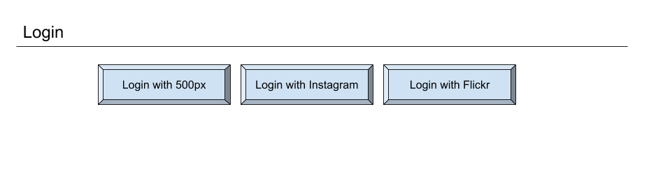
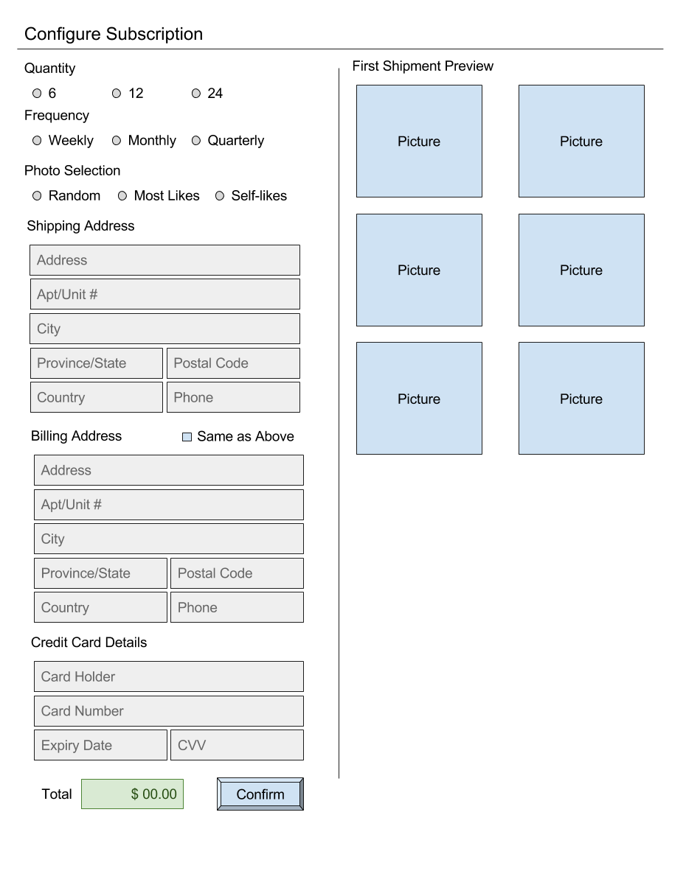
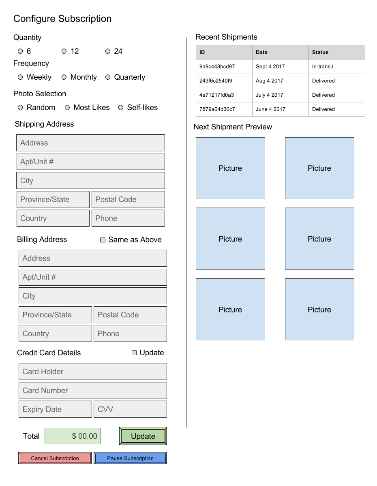

# Print Subscription

## Introduction

Subscribe to physical prints from Instagram feeds and/or other photosharing sites. Customers will finally be able to put up their favourite Instragram shots at home or the office, without ever having to go to a photo finisher to print them. Customers would let the system pick photos for them automatically according to the customer's preference. Those photos would be printed and shipped to the user with a customizable frequency.

## User Interface Design and Prototype

### Login

The login page relies on OAuth logins from sites which we will use as media sources. The OAuth services shown are only examples. Other possible services include Google Photos, Facebook, Twitter, Tumblr, and Reddit.

### New and Configure Existing Subscription

Limited customizability and an all-in-one design keeps effort low and trasparency high.

## Navigation Structure

Users will be limited to a single subscription per user account. This is reasonable because each user account is tied directly to a source of images. This limits the amount of navigation required and keeps the flows extremely simple.

### Flow 1: New Subscription

1. *Login* - User clicks on one of the OAuth login provider buttons. A new window opens with the OAuth provider's login page. On completion, the OAuth provider returns the user to our site.

2. *New Subscription* - The user lands on the New Subscription page. Here they select their subscription options, entire their shipping and billing details. Upon confirmation and successful payment, the user is sent to the Confgiure Subscription page along with a banner message indicating success.

### Flow 2: Configure Existing Subscription

1. *Login* - User clicks on one of the OAuth login provider buttons. A new window opens with the OAuth provider's login page. On completion, the OAuth provider returns the user to our site.

2. *Configure Subscription* - The user lands on the Configure Subscription page. Here they have the ability to change their subscription options, as well as their shipping and billing details. Upon successful changes, the user is returned to the Configure Subscription page along with a banner message indicating success.

### Flow 3: Cancel Existing Subscription
1. *Login* - User clicks on one of the OAuth login provider buttons. A new window opens with the OAuth provider's login page. On completion, the OAuth provider returns the user to our site.

2. *Configure Subscription* - The user lands on the Configure Subscription page. Here they can use the Cancel Subscription button. Clicking this will cause an "Are you sure? Y/N" dialog to appear. If the user selects yes, their subscription will be cancelled and they will be returned to the New Subscription page along with a message indicating successful cancellation.

### Flow 4: Pause Existing Subscription
1. *Login* - User clicks on one of the OAuth login provider buttons. A new window opens with the OAuth provider's login page. On completion, the OAuth provider returns the user to our site.

2. *Configure Subscription* - The user lands on the Configure Subscription page. Here they can use the Pause Subscription button. Clicking this will cause an "Are you sure? Y/N" dialog to appear. If the user selects yes, their subscription will be paused and they will be returned to the Configure Subscription page along with a message indicating successful pause.

## References
* 500px API Documentation: https://github.com/500px/api-documentation
* Instagram API Documentation: https://www.instagram.com/developer/
* Flickr API Documentation: https://www.flickr.com/services/api/
